# JOURNAL

Welcome to the JOURNAL! This document holds the timeline, decisions, and designs that have trademarked the work I've put into Stardeck thus far. Here are the summaries from each date.

## 2026-06-15
This is where it starts. The project in question was a cyberdeck, we knew that much for sure. But what takes me to a cyberdeck exactly? What are the goals? What's the minimum possible device that would count as a cyberdeck? Would this be too strenuous for a self-declared software guy to do? There was only one way to find out.

To start in doing the thing, I wanted to at least know what the goals were. I reasoned the goal into this: _Build the ugliest possible cyberdeck and submit it to Stardance, including what I learned from building it._ Probably not the nicest maker if I'm calling my own projects ugly, but the idea is that aesthetics and twist-giving, defining features can wait until I can actually figure out how to get a cyberdeck booting first. We can add more features and aesthetics later, but something that boots is our main priority, similar to how you need to know how to make a cheese pizza before making one with toppings. In other words, the goal is to get a cyberdeck working, and the Minimal Viable Product (MVP) is a cyberdeck that works.

Oh, I also chose what I'll use for the cyberdeck's brain - a Raspberry Pi. The specific model will be a Raspberry Pi 4B with 4GB of RAM, and it packs a lot of computing efficiency compared to what I used to think Single-Board Computers could do. This thing can boot an OS, interact with components, connect using Internet and Bluetooth, and more - plus, the Pi is a clear favorite of first-time cyberdeckers (whatever you call them).

_TL;DR:_
- Defined project goals and MVP.
- Selected Raspberry Pi as the compute platform.

**Time Spent This Session: 0 Hours (Exclusively research)**

## 2026-06-16
KiCAD is a tool that allows you to create electrical schematics for components such as custom Printed Circuit Boards (PCBs). I like to think of it as Onshape, but for electricity. One good thing that comes from this is that I'm able to use the basics to visualize components and pins at the very least, even if I don't use a PCB for the initial cyberdeck. Wiring concepts were coming through, and I got to thinking about what makes a cyberdeck a cyberdeck.

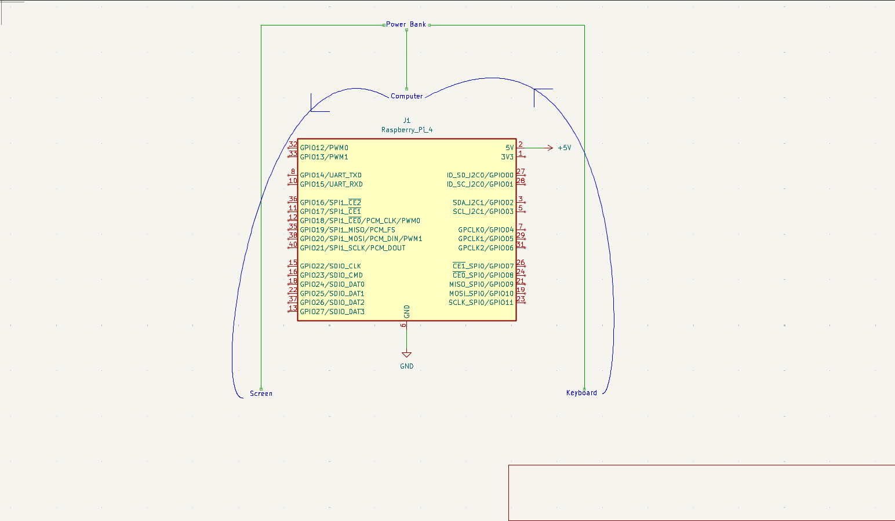

Okay, so about KiCAD...it was helpful, but not exactly the tool I needed. KiCAD is the tool that guides you through schematics, PCBs, circuits, and other feats of electrical engineering. That's great and all, but it wasn't exactly the thing that I was going for all the way because my component connections were occuring on the component level rather than the electrical level. I knew that I would have to plan out how every component would fit together, and so I started an initial packaging study exclusively using a placeholder for only a few parts. This helped me think of the general shape of the cyberdeck before commiting to working on more of the packaging study, and I went with a tablet-style cyberdeck for the first iteration.

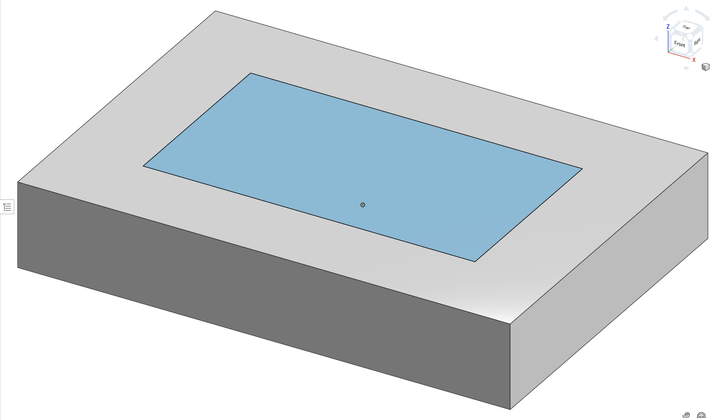

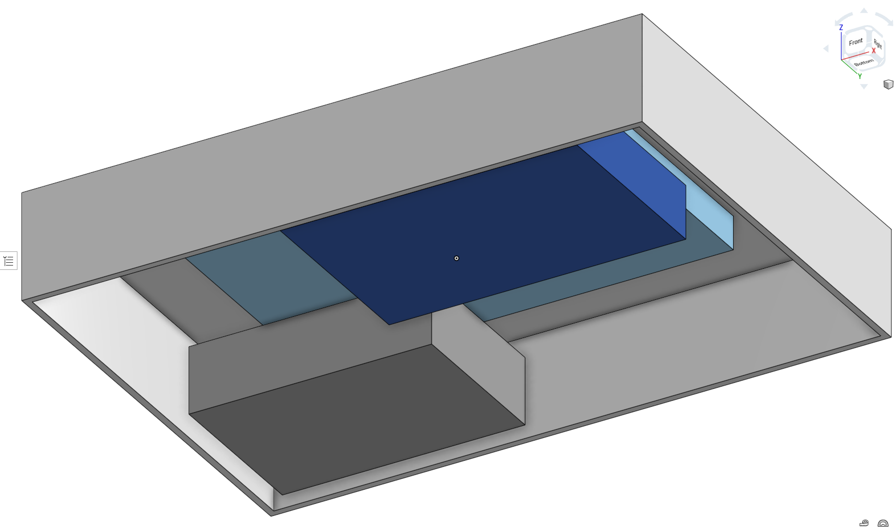

With these in place, I published my very first devlog to Stardance to hear what others thought so far. I tried to write in a formal tone like I tend to do for replicable public work, but we'll see how the tone of voice fits in.

_TL;DR:_
- Learned KiCAD basics.
- Drew initial wiring concepts on KiCAD.
- Determined a custom PCB wasn't needed for v1.
- Posted Devlog #1 to Stardance.

**Time Spent This Session: ~1.5 Hours**

## 2026-06-17
I had to figure out how I was going to plan everything out if KiCAD wasn't necessarily my best bet. That's when I was looking into tools online and found draw.io - an open-source drawing platform that allows you to create diagrams for development workflows. This really fit what I was going for, and after learning the basics, I worked through the first few elements, which represented the components of Stardeck.

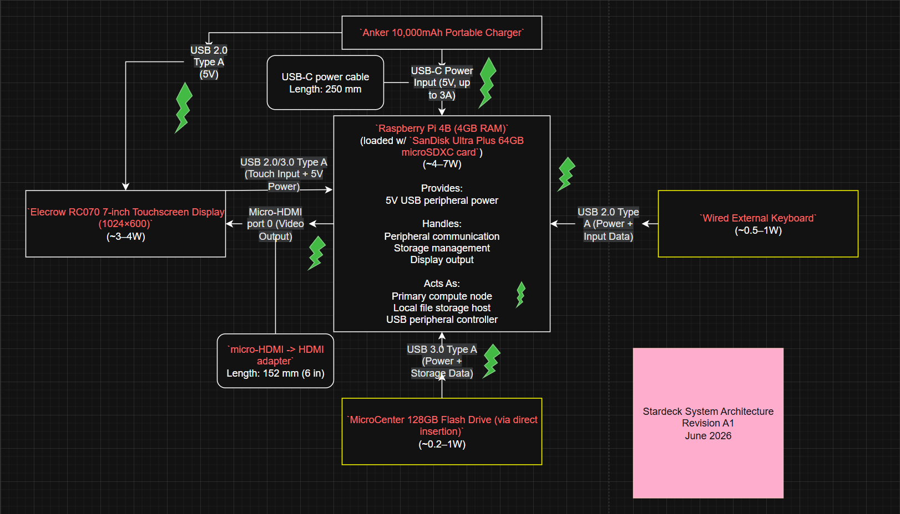

_TL;DR:_
- Learned how to use draw.io for diagrams.
- Started making a wiring diagram with draw.io.

**Time Spent This Session: ~0.5 Hours**

## 2026-06-23

Yeah, my tone of voice wasn't hitting the right notes with the audience I had. My devlog seemed so distant from the audience compared to others I've seen on Stardance. Some even considered the devlog to be AI writing, even though that was far from the truth. I was confused. If everyone saw my work right there, why did it still seem like a robot was talking to them? That's when I realized that seeing my work wasn't enough when that was all they could see. My audience wanted to hear about the journey and the steps in between, not just the ending. That's when I committed to keeping future devlogs story-focused so that I wouldn't receive any doubts as to if I was the one on the keyboard.

When looking through my display options, I needed something that would have enough functionality to pack into a cyberdeck with the goal of making it work. On top of that, I later realized that my display also needed to boot with everything else. Adapters should be included if necessary, our port maps should align with our long-term goals, and our screen had to be mountable. With these in mind, I chose a 7 inch touchscreen display from Elecrow, which supported the Raspberry Pi and could fit into the enclosure I had in mind.

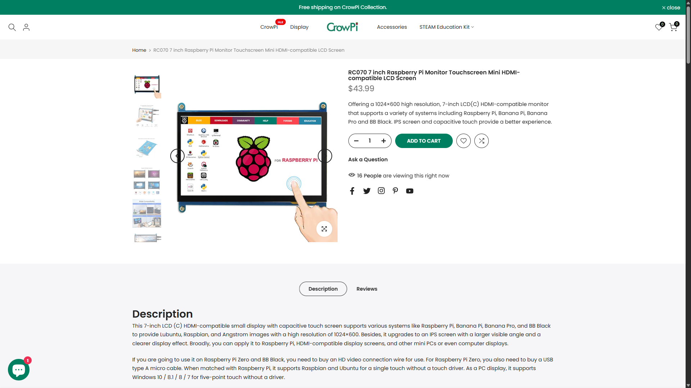

I used these same design ideas for starting my Bill of Materials (BOM) which can tell Hack Club which parts I need when it's time to get funded. I was able to pick out essentials such as a MicroSD card (system storage), a power bank/battery (distributes power to everything else), and more.

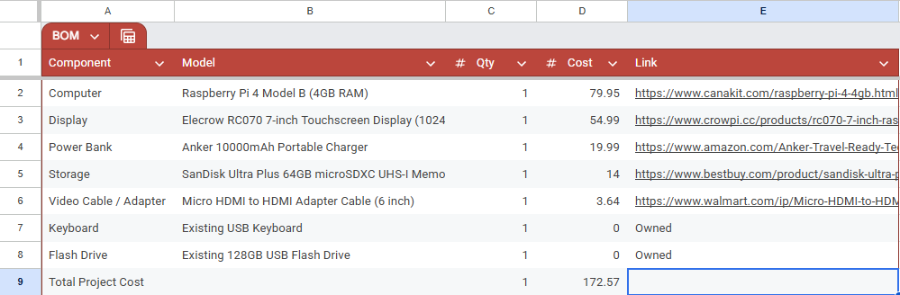

Another great thing that came with finding these components online was that they came with dimensions that reflected just how long, wide, or tall something was, which was bound to help me as I set out to gather info that may be useful for a packaging study.

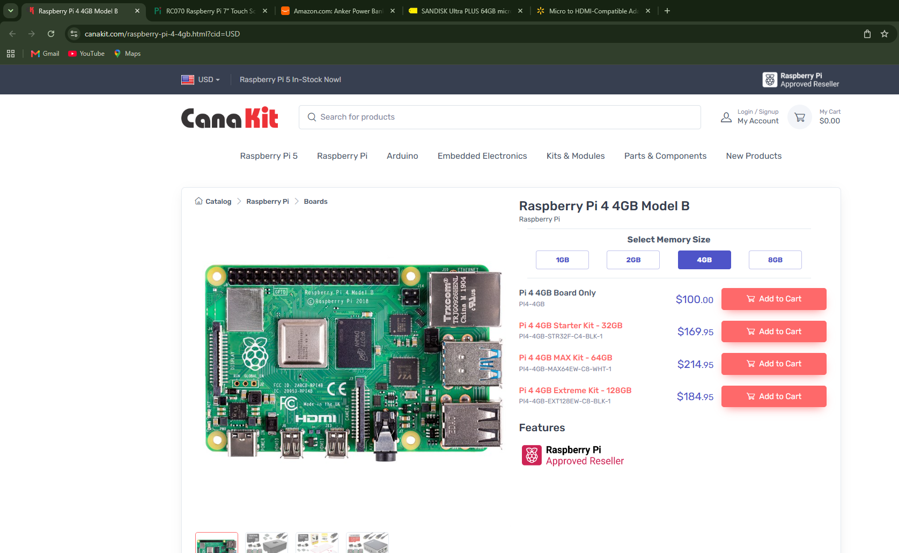

_TL;DR:_
- Reworked my devlog writing style.
- Compared display options.
- Started BOM.
- Estimated component dimensions.

**Time Spent This Session: ~1.5 Hours**

## 2026-06-24

Time for the real packaging study. These are involving parts that should work together surprisingly well if the wiring diagram stays true to its word.

I started by modeling a few of the individual parts - screen, enclosure, Pi, and more. Luckily, the model's didn't need to have too much time put into them during the packaging study because all I needed to dow as model each parts as a rectangular prism of the same dimensions and model around that. Once my parts were accounted for, I used the "simple" component models to choose how big my enclosure needed to be. This was a big tradeoff to account for in the project because I wanted to have enough space for every component, but I didn't want to waste filament or create something bulky that doesn't fit the portable size requirement I had in mind.

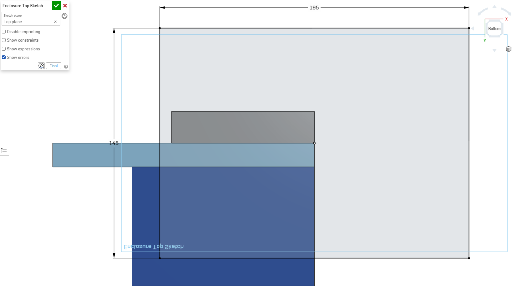

The enclosure sizing I came up with was great - 145 mm by 195 mm, with a depth of 38.75 mm. I also shelled out one of the faces to create 2.5 mm walls and cut out an opening for the display to sit in. After a lot of thought into how the system would act, it was time to figure out how the system should look.

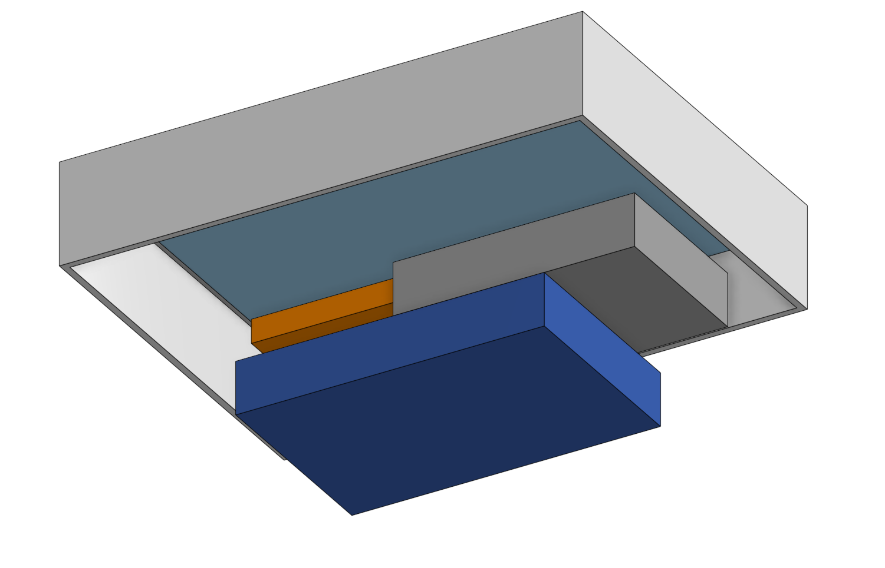

_TL;DR:_
- Began packaging study in Onshape.
- Created simplified component models.
- Tested enclosure sizing.

**Time Spent This Session: ~0.5 Hours**

## 2026-06-28

My deisgn was coming together. I modeled other parts such as my existing USB flash drive to provide additional storage to the user and cables that would depict possible cable routes from part to part. Once I got the internal parts done, I was thinking to myself about how every part would be physically built, until I realized that that would be close to impossible. The reason for this was that my enclosure was essentially just a plastic box with the lid missing. That's when I went through some decision-making to choose the enclosure that would solve this problem, highlighted below as one of my design decisions.

After the decision was made, I settled on a clamshell design that utlized two shells, top and bottom, to make up two different halves of the enclosure.

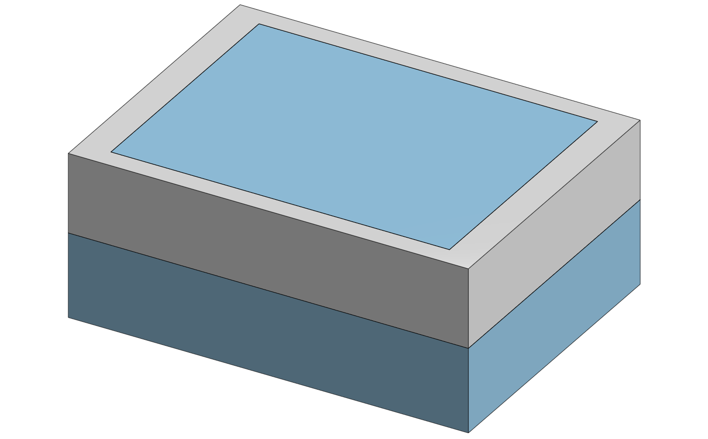

Complemented by alignment lips to keep the halves level with each other when screwing them together later, I had a real deisgn coming up. The next real objectives were to turn my design into something that others could understand, since some parts of my enclosure still seemed like they could use more documentation.

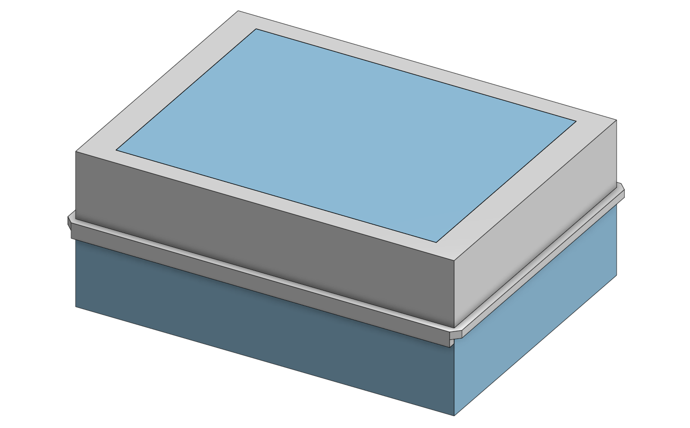

Furthermore, it's not like the Raspberry Pi was going to levitate in the real build. After understanding that the Pi doesn't come with flying powers, I designed simple mounting rails thanks to the design decision outlined at the bottom, which served as a working solution. I also knew of the Raspberry Pi's mounting capabilities (such as M2.5 screw holes in its corners) and how those capabilities would work well with the mounting rails in the long run.

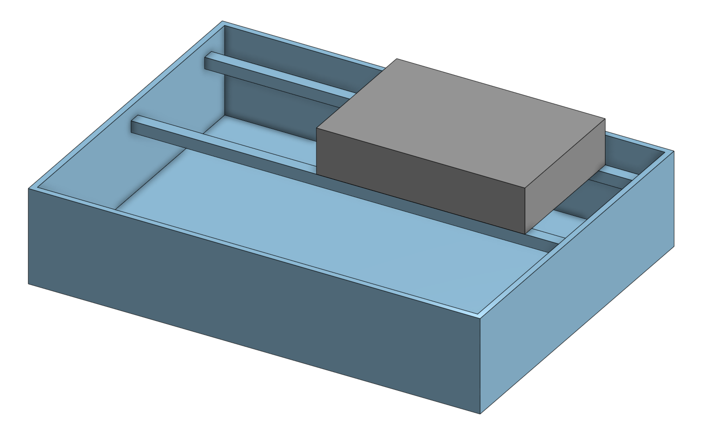

_TL;DR:_
- Switched from a one-piece enclosure to a clamshell design.
- Added alignment lips after evaluating assembly.
- Added mounting rails to support the Pi.

**Time Spent This Session: ~1.5 Hours**

## 2026-06-29

Just some polish to make things easier later. I checked over part sizes, compared them to the real components, and looked through how I could keep them in place according to what I could find online about each part. This let me learn lots of neat features about each of my parts. For example, why is the size of the screen diagonal about 8 inches when Elecrow says the screen diagonal is 7 inches? The answer: border features. The screen came with features on the border such as mounting holes and ports that required the actual diagonal measured across the surface in Onshape's perspective to be bigger than that of the screen only. Most, but not all, of that face belongs to what will actually be displayed. Nuances like this were picked up well, but apart from the research, many tweaks were made in sizing and positioning to make assembly easier later, with the main tweak being a battery tray. Another design decision below walks you through how I chose my battery mounting method, and the battery tray won over mounting straps because of its simplicity and intuition; it's like putting square pegs into square holes.

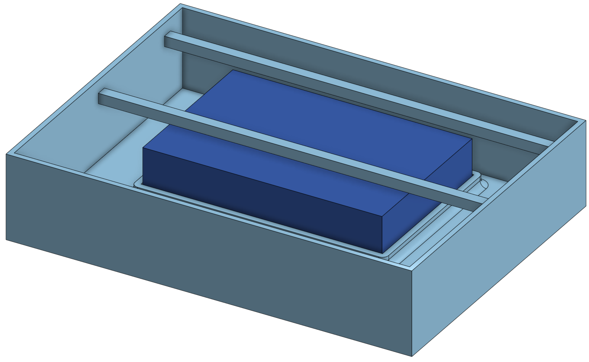

_TL;DR:_
- Polished wiring presentation quirks at the assembly level.
- Added battery tray to keep the battery stable.

**Time Spent This Session: ~0.5 Hours**

## 2026-06-30

Wait, so the parts _don't_ attach by themselves? I thought so. Good thing I thought of adding screw holes to anywhere that keeping parts from falling or sliding reall mattered. I added screw holes in both enclosure halves to keep internals stable once I have the finished build,

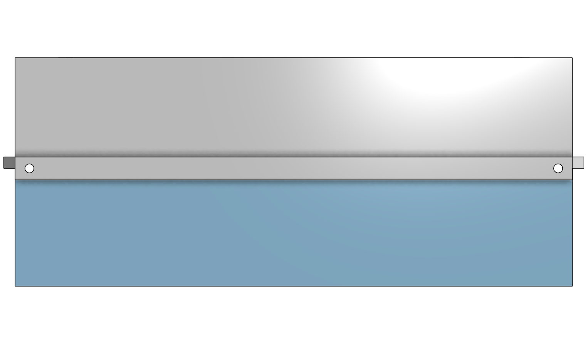

on the mounting rails to keep the Pi in place,

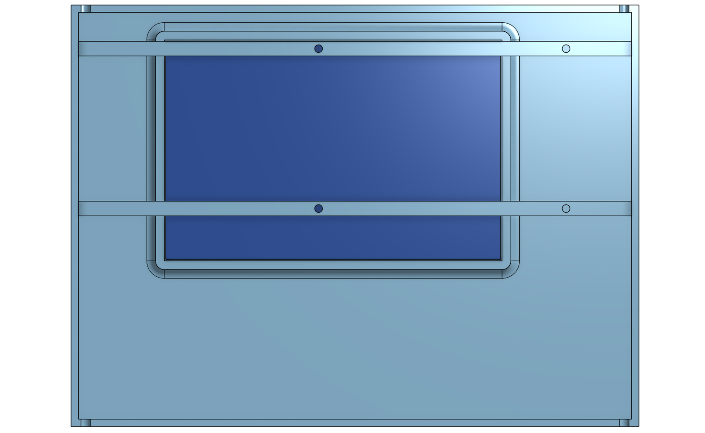

and on the corners of the display cutout to mount the display in place.

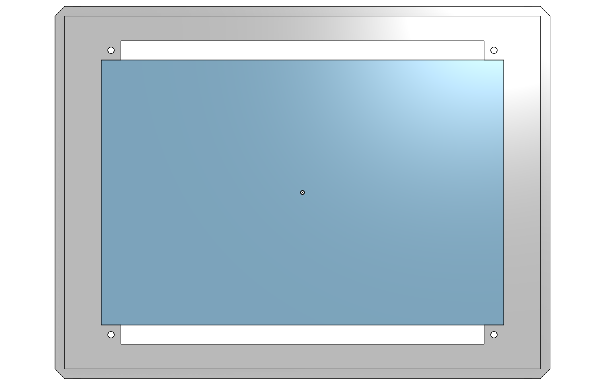

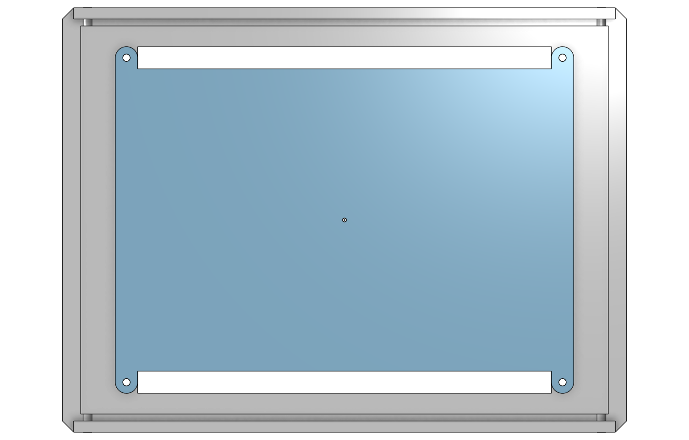

I used M2.5 holes for the Pi and display, along with M3 holes for the enclosure halves.

For documentation to work out later, I created two exploded views to tell the story of my assembly. The first one is a regular exploded view - showing the front, top, and side profiles - and another is a layered sort of exploded view - a front view of exploded parts that explains how every component is grouped and layered internally, which explains the tablet-like shape very well!

### Exploded View Part Numbers

1. Top Enclosure
2. Bottom Enclosure
3. Raspberry Pi
4. Battery Pack
5. Screen
6. Flash Drive
7. Alignment Lip
8. Battery Tray
9. Mounting Rails

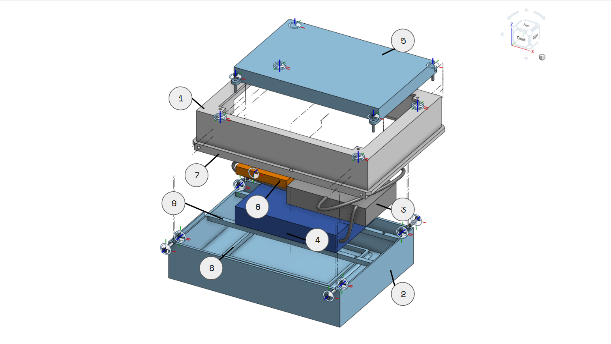

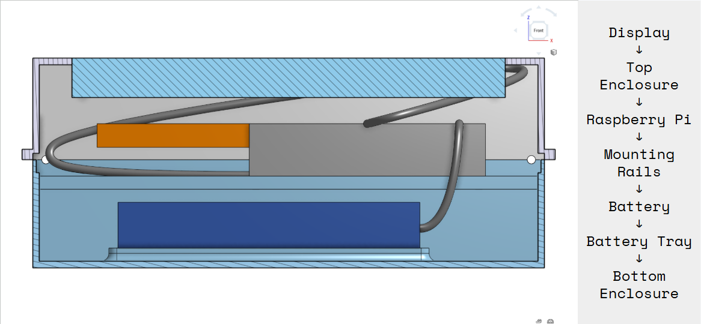

_TL;DR:_
- Added clearance holes to mount parts via screws and nuts later.
- Created two exploded assemblies (one a total assembly, another a layered assembly).

**Time Spent This Session: ~2 Hours**

## 2026-07-01

At this point, I was celebrating away. I started off with labeling my main exploded view, which made me realize just how much of my enclosure is truly done right now. I was surprised to find that all the components fit together in one enclosure, but when looking at the Pi in specific, I visualized the USB ports near where the flash drive was modeled. That's when I finally realized that the outside world still exists and I still need a way to connect external devices to the Pi whent he enclosure is sealed off.

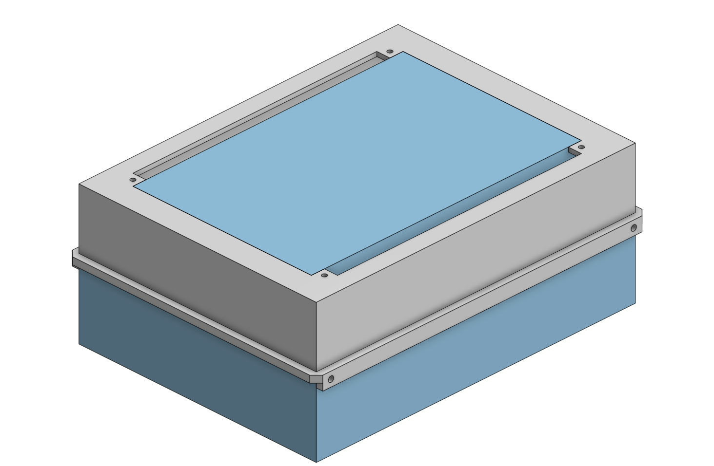

This realization led to the creation of a side port cutout, which allows me to connect USB-based devices easily.

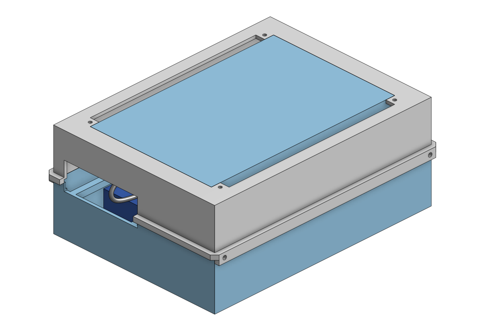

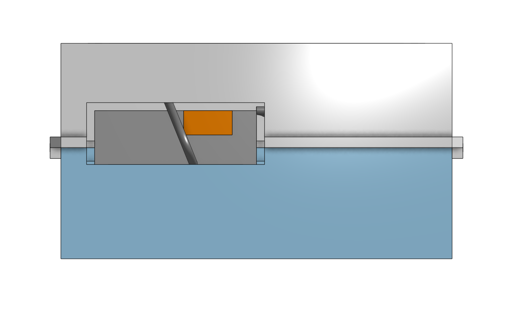

I updated my assembly documentation so that it was up to date with the project thus far - the cyberdeck was already planned out physically using a packaging study, and the wiring diagrams had every component interaction mapped out and planned.

All that was left to do was share this with Stardance with another devlog - and this one reflected more of the shaky, nonlinear path that took Stardeck to where it was. The time that I put into planning ahead of real-world constraints through digital means paid off in the end, and it reminded me why I build things such as Stardeck - to teach myself. Lots of engineering went through fitting the embedded systems together, and that showed. After posting my devlog, I also felt a real connection with the other builders on Stardance just by sharing what I had to demonstrate. I think that connection is what the storytelling was meant to be. They've only been awarding points for storytelling (not merely "documentation") all along, which is how I learned that the best projects take others along for the ride.

_TL;DR:_
- Realized external USB ports would be inaccessible.
- Added side port cutout.
- Updated assembly documentation.
- Posted Devlog #2 to Stardance.

**Time Spent This Session: ~2.5 Hours**

## Design Decisions

The following design decisions impacted the long-term path that Stardeck followed. This doesn't necessarily mean tha tthey were the hardest to make, but it means that designs following these decisions were impacted by these sets of decisions making.

1. Enclosure Structure

During the CAD process, I realized that modeling parts inside an enclosure is useless if the enclosure cannot open and close. This was the base idea for the USB port issue mentioned before, and it led to a choice between different types of closure methods:

- Back Panel: This would be similar to opening a computer case. One back panel can be unscrewed, giving you access to internals. When you're done, simply reinstall the back plate. This was an enticing option for its simplicity and reliability. Even the PC I'm using right now probably implements a back panel layout.

- Snap Fit: This seemed like the flashiest option. I realized, however, that printer tolerances would make a trivial feature of the enclosure that much harder to replicate and I wanted a method that would work over and over. Snap fits always seem like fun and games until your printer tolerances don't want to play.

- Clamshell: This is what I ended up going with. The top shell and bottom shell are two halves of the same, clam-like enclosure, and it allowed me to have the best command over internals. This won out over the back panel design because I could add, modify, and swap out components using angles from more than one face, which promised a higher likelihood of a successful assembly. Overall, this hit the sweet spot between being too fragmented and abstracting away important constraints.

2. Mounting the Raspberry Pi

My initial placeholder assembly, which didn't account for every component, led me to initially bring the Pi above the battery inside the model. However, there had to be a way for the Pi to stay up there, since parts can't levitate in real life just because they can levitate in Onshape. I had to make a choice here, too.

- Corner Standoffs: These would basically act as poles that hold up the Pi by the corners. When I was modeling this in relation to other parts, however, this didn't work because some poles would be standing in the battery tray's space, which interferes with the battery. I was back to the drawing board as I had to think of something else.

- Floor Plate: The idea for this would be that the Pi would have a floor for it to rest on top of near the middle of the enclosure's height, sort of like a mezzanine or a tab that covers some of the bottom shell's view of the inside top shell looking up. However, this would interfere with the assembly later on - not the components, but the wiring. Generally speaking, the more internal obstacles and parts you add inside of an enclosure like the one I had, the less viable paths there are for wires to travel through. What we needed had to be a reliable mix of useability and efficiency, and I eventually found a mounting strategy that seemed strong.

- Mounting Rails: These fulfilled the task of holding the Pi up while also promising a simple yet elegant design that can work around other parts. With rails holding the Pi up, I was able to design cable routes that worked and had enough buffer to work around other paths if necessary. The rails also had a certain thickness to them that made it possible to truly mount the Pi in place using M2.5 screws inserted into clearance holes in the rails. Mounting Rails were the most efficient working solution I could come up with, and I'm seeing how much time and energy I saved myself in the long run.

3. Mounting the Battery

The battery needed external support if it also wanted to be held up like the Pi. The battery I chose gave a good amount of power for such a manageable size, but there were many different ways to keep a battery from moving around too much.

- Mounting Straps: These seemed like the best long-term idea to me. It kept the battery in place (even when upside-down) and provided the most space-effective ways to keep the battery steady. However, these still were a very technical type of item to use for a minimum viable product, and so I turned this down for now.

- Battery Tray: This decision was made a lot quicker than my others, and I think the reason why is because I knew not to fix anything if it wasn't broken. A rectangle-shaped boundary gating allows the battery to stay in place without the need of buying more for something that can be solved using CAD. If the 0.5mm clearance I added for extra spacing on all sides causes the battery to move around unstably, I could always use a temporary solution like tape to make up for the clearance.

## Lessons Learned

- Not only does CAD design parts, but it detects assembly-level problems before you do.
- If a mounting option is simple, that's probably the option you'll choose - not because complexity is bad, but because the simple solutions are the easiest to upkeep and monitor.
- If you think about your physical assembly before printing, you'll save LOTS of time later.
- Every design decision quietly changes three others, so weigh the pros and cons of what you do.

And finally:
- Software guys can rock with hardware, too - just look at the intersection between software and hardware, demonstrated by Stardeck!

Hope you enjoyed reading the story Stardeck has to tell!

Signing off,
Yodahe