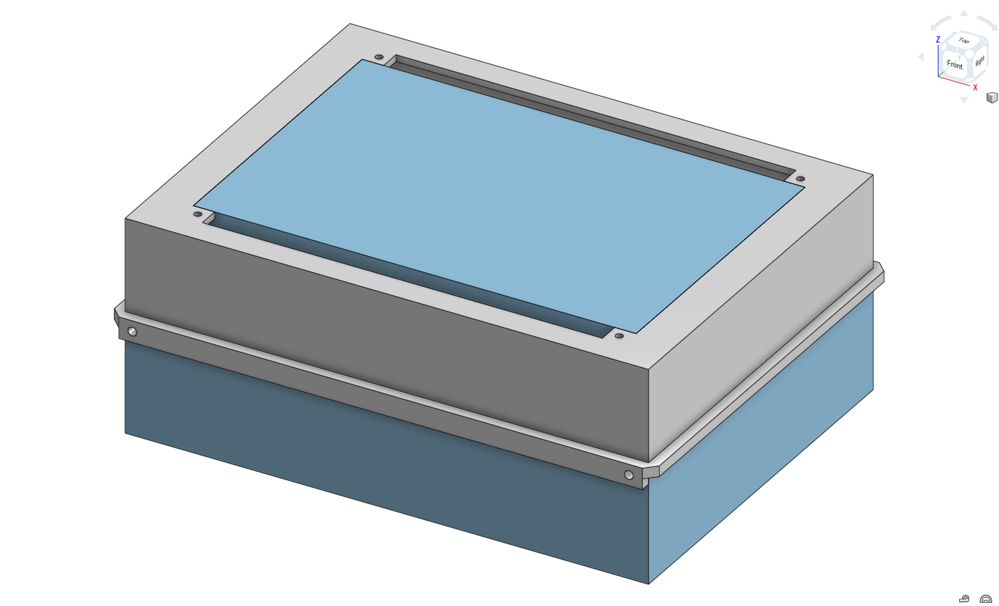

# Stardeck

A minimalist cyberdeck made for a software guy to learn embedded systems, electronics, and hardware design.
Made for Hack Club's 2026 Stardance Challenge.

Learn more here: https://stardance.hackclub.com/

View my project on Stardance here: https://stardance.hackclub.com/projects/19479

View the Onshape document here: https://cad.onshape.com/documents/8bb1ca9b7e5ac3a8ddb6398c/w/dff90e83964596d1d17b9d10/e/fb41c0251ce7e4dd570a11cb?renderMode=0&uiState=6a45b81e4e7578b1759ce83d

## Overview

This cyberdeck is a personal project for teaching me the art of hardware engineering through doing. I've been interested in cyberdecks ever since first seeing them in a post on r/cyberdeck, and I'm looking forward to manifesting that interest by making my own. Instead of buying a built device online, I wanted to learn how designing hardware works - from ideas to plans to products. Having the ability to add even a few lines of code to a repo you may be working on using a device that doesn't take up that much space is just one possibility with cyberdecks, with many others opening up once I get a working prototype built.

## Design Philosophy

Stardeck is designed and built using inexpensive components and open-source tools that ensure that anyone could build their own Stardeck.

The first revision will target simplicity and learning through engineering design, which will enable me in future revisions to improve upon Stardeck by testing it in the real world.

## Goal

**First Goal:** Build the ugliest functional cyberdeck possible this summer and submit it to Stardance.

Stardeck prioritizes functionality and learning over aesthetics for its first version. Once the system is operational, later iterations will focus on usability, appearance, and additional features. This approach prioritizes reaching a working MVP before focusing on aesthetics or refinement (although, those can be reached once we actually have something that boots).

## Hardware

The hardware required for this first version is very minimal, with every part having a purpose that directly translates to functionality. Technical details can be reduced by breaking down my project into its main components:

Computer: The brain behind Stardeck doesn't need much space, but it has much to offer—the Raspberry Pi. This single-board computer has the ability to run an OS, surf the web, connect external devices, and more, while also able to fit into my pocket.

Display: A compact 7-inch touchscreen can act as the main visual interface for the Raspberry Pi while also providing touchscreen input.

Power Bank: This portable recharge base is what gives this valuable resource to all the other components.

Storage: The Pi needs an OS to run on, and that OS needs storage for the Pi to boot from. A microSD card should have enough storage to comfortably boot an OS and store any necessary files once booted.

Video Cable / Adapter: The display can communicate with the Raspberry Pi over HDMI for video and USB for touch input and power. Since the Raspberry Pi only has ports for micro-HDMI, a micro-HDMI adapter or cable may be used.

Keyboard: An external USB keyboard, which I will provide, will be required to make sure the MVP can take inputs.

Flash Drive: If any more storage is owned, the Pi can access files from a Flash Drive I already own that should have enough storage for Stardeck to live off of.

## Bill of Materials (BOM)

| Component | Model | Qty | Cost | Link |
|-----------|--------|----:|-----:|------|
| Computer | Raspberry Pi 4 Model B (4GB RAM) | 1 | $79.95 | [Canakit](https://www.canakit.com/raspberry-pi-4-4gb.html?cid=USD) |
| Display | Elecrow RC070 7-inch Touchscreen Display (1024×600) | 1 | $54.99 | [CrowPi](https://www.crowpi.cc/products/rc070-7-inch-raspberry-pi-monitor-1024x600-touchscreen-mini-hdmi-lcd-screen?variant=39701750775941&country=US&currency=USD&utm_source=chatgpt.com&oppcref=e96bec25-1e39-4ef8-afa0-9b23e74db94f) |
| Power Bank | Anker 10000mAh Portable Charger | 1 | $19.99 | [Amazon](https://www.amazon.com/Anker-Travel-Ready-Technology-High-Speed-Output%EF%BC%88Black%EF%BC%89%EF%BC%8C1pack/dp/B0D5CLSMFB?th=1) |
| Storage | SanDisk Ultra Plus 64GB microSDXC UHS-I Memory Card | 1 | $14.00 | [Best Buy](https://www.bestbuy.com/product/sandisk-ultra-plus-64gb-microsdxc-uhs-i-memory-card/JXJ62C647Q) |
| Video Cable / Adapter | Micro HDMI to HDMI Adapter Cable (6 inch) | 1 | $3.64 | [Walmart](https://www.walmart.com/ip/Micro-HDMI-to-HDMI-Adapter-Cable-4K-60Hz-15cm-6-inch-Short-Cord-for-Raspberry-Pi-5-4-Camera-Tablet-HDTV/19994810413?wmlspartner=wlpa&selectedSellerId=103086963&veh=seo_fpl&cn=google) |
| Keyboard | Existing USB Keyboard | 1 | $0.00 | Already owned |
| Flash Drive | Existing 128GB USB Flash Drive | 1 | $0.00 | Already owned |

**Estimated Total Project Cost:** $172.57

## System Architecture

Stardeck can be broken down into four subsystems - power, computing, input, and output - that interact as outlined below. The biggest challenge that came from planning out component interactions is that I did not have the actual parts at hand at that time, so I had to gain experience with designing around parts that only existed in ideation. Putting them into designs ended up answering the question of how Stardeck works electrically.

## Packaging Study

The purpose of the packaging study was to plan our assembly beforehand. We didn't have the parts yet, so I went into Onshape and designed our first iteration's enclosure. I went with a clamshell design with lip alignments to keep both halves in line and screws and nuts to keep them from sliding apart. Our enclosure dimensions were 195 mm x 145 mm x 80 mm, which seemed compact at the time, so I was surprised to see that all the parts fit into our enclosure with room to spare for wiring and assembly.

Also note that I modeled each part as a simple rectangular prism that reflected the height, width, and depth of each part to minimize complexity and focus on space utilization. With space in mind, I didn't need to model my keyboard - which would connect to the system externally - and I didn't need to model the microSD card either - which had negligible size compared to the Pi it would be inserted into. Cable routes will be finalized during the physical assembly since the only purpose of the cable routes modeled below are to represent feasible routing paths, not exact cable geometry.

| Number | Component |
|-----------|--------|
| 1 | Top Enclosure |
| 2 | Bottom Enclosure |
| 3 | Raspberry Pi |
| 4 | Battery Pack |
| 5 | Screen |
| 6 | Flash Drive |
| 7 | Alignment Lip |
| 8 | Battery Tray |
| 9 | Mounting Rails |

Space was a valuable asset of this entire operation because not only did every part have to fit together, but every part had to be assemblable after I got each part. In other words, if I position the battery tray in such a space that it becomes impossible for the battery to be placed there, the packaging still needed work. Luckily, the design that I came up with utilized the clamshell for feasibility and modularity, which would suffice for our first version. The alignment lips, battery tray, and mounting rails made sure that assembly would be straightforward, start to finish.

## Progress

- [x] Selected hardware
- [x] Created wiring diagram
- [x] Created BOM
- [x] Designed enclosure
- [x] Completed packaging study
- [ ] Print first prototype
- [ ] Assemble hardware
- [ ] Install Raspberry Pi OS
- [ ] Boot v0.1

## Roadmap

### Near-term
- Print enclosure
- Assemble electronics
- Boot Raspberry Pi OS
- Validate packaging

### Long-term
- Integrated 60% keyboard
- SSD
- Modular expansion
- Improved enclosure

These enhancements are intentionally deferred until the initial prototype validates Stardeck's core terminal and file-management workflows.

## Current Status
Prototype design complete.
Next up: Prototype fabrication.

## Learn More
Visit the `docs` folder to follow the project's development through design notes and devlogs.