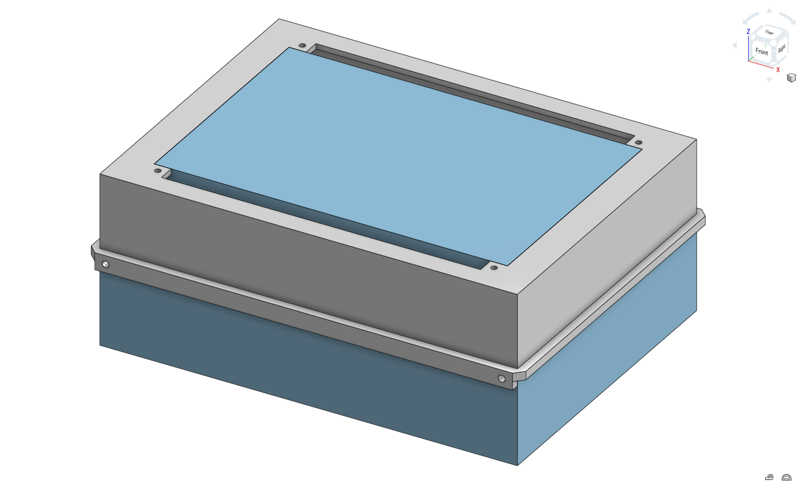

# Stardeck

A minimalist cyberdeck made for a software guy to learn embedded systems, electronics, and hardware design.
Also, a project made during and for Hack Club's 2026 [Stardance Challenge](https://stardance.hackclub.com/).

[Stardance Project Page](https://stardance.hackclub.com/projects/19479)

## Hero Image

## The Design

View the Onshape document [here!](https://cad.onshape.com/documents/8bb1ca9b7e5ac3a8ddb6398c/w/dff90e83964596d1d17b9d10/e/fb41c0251ce7e4dd570a11cb?renderMode=0&uiState=6a45b81e4e7578b1759ce83d)

## What can Stardeck do?

Once the hardware is assembled, Stardeck would be able to:
- Boot Raspberry Pi OS
- Surf the web
- Download and upload files
- Connect to external devices
- Work with a touchscreen (no mouse required!)
- Allow for further customization in the future (through the Pi's GPIO pins)

## Bill of Materials (BOM)

| Component | Model | Qty | Cost | Link |
|-----------|--------|----:|-----:|------|
| Computer | Raspberry Pi 4 Model B (4GB RAM) | 1 | $0.00 | Already Owned |
| Display | Elecrow RC070 7-inch Touchscreen Display (1024×600) | 1 | $54.99 | [CrowPi](https://www.crowpi.cc/products/rc070-7-inch-raspberry-pi-monitor-1024x600-touchscreen-mini-hdmi-lcd-screen?variant=39701750775941&country=US&currency=USD&utm_source=chatgpt.com&oppcref=e96bec25-1e39-4ef8-afa0-9b23e74db94f) |
| Power Bank | Anker 10000mAh Portable Charger | 1 | $19.99 | [Amazon](https://www.amazon.com/Anker-Travel-Ready-Technology-High-Speed-Output%EF%BC%88Black%EF%BC%89%EF%BC%8C1pack/dp/B0D5CLSMFB?th=1) |
| Storage | SanDisk Ultra Plus 64GB microSDXC UHS-I Memory Card | 1 | $14.00 | [Best Buy](https://www.bestbuy.com/product/sandisk-ultra-plus-64gb-microsdxc-uhs-i-memory-card/JXJ62C647Q) |
| Video Cable / Adapter | Micro HDMI to HDMI Adapter Cable (6 inch) | 1 | $3.64 | [Walmart](https://www.walmart.com/ip/Micro-HDMI-to-HDMI-Adapter-Cable-4K-60Hz-15cm-6-inch-Short-Cord-for-Raspberry-Pi-5-4-Camera-Tablet-HDTV/19994810413?wmlspartner=wlpa&selectedSellerId=103086963&veh=seo_fpl&cn=google) |
| Keyboard | Existing USB Keyboard | 1 | $0.00 | Already owned |
| Flash Drive | Existing 128GB USB Flash Drive | 1 | $0.00 | Already owned |

**Total Project Cost (USD): $92.62**

## How Stardeck Works

As a cyberdeck, what Stardeck has that laptops from big tech may not have is a simple digital experience. With no bloatware or ads pushed onto the user, your device is truly yours. Of course, the planned device for now is a minimum viable product focusing on what Stardeck can do to join the cyberdeck club.

The parts that'll be used consist of:
- Raspberry Pi 4 Model B
- Elecrow Touchscreen Display
- Anker Portable Charger
- microSDXC Memory Card
- microHDMI to HDMI Adapter Cable
- Keyboard
- Flash Drive

The parts will be organized together to fit into a 3D printed enclosure of my design. To understand how Stardeck works, we can look into the purposes of each part and how they interact. The Raspberry Pi was chosen to handle all of Stardeck's computing tasks because it was capable of running a dedicated OS, connecting to the outside world (Internet, Bluetooth, USB-A), and intuitively receiving power without turning Stardeck into a gaming rig. The touchscreen display from Elecrow keeps the enclosure simple with the added bonus of running Stardeck independent of a mouse. The usage of two different memory sources, the memory card and the flash drive, abstracts away logistics/"stats for nerds" for the user's sanity - the memory card can hold OS and system files for the Pi while the flash drive can hold personal files and executables for the user.

These are the parts that I'm using, but what about the part that I'm designing - the enclosure? I went with a two-piece clamshell design for its elegant ease of use. After adding alignment lips to help with nesting the top half onto the bottom shoebox-style, I continued adding physical features as necessary. For example, the mounting rails on the bottom half are the Raspberry Pi's stepstool; they keep the Pi near the middle of Stardeck so it can connect to all the other parts easily. A battery tray also makes up the bottom half to keep the battery pack from sliding all around. When I was figuring out which side to place the battery tray into, I realized how annoying it would be to nudge the battery pack under the mounting rails, so I chose the side opposite to it on the enclosure floor to save myself from crying later. As for actually keeping these parts' order, I used threaded bosses as my holes in the mounting rails, top half, and alignment lips to cooperate with screws that'll mount the Raspberry Pi, screen, and enclosure halves respectively. After months of designing/wrestling around parts I didn't have, the main lesson I've learned is that the toil of predicting and fixing hardware problems before they show themselves to you is just one step prior to the fun part I'm hoping for: getting a usable Stardeck to work IRL.

## Acknowledgements

The [Stardance Challenge](https://stardance.hackclub.com/) is what pushed me to take an idea and turn it into something unmistakably mine this summer. Go check them, and [Hack Club](https://hackclub.com/), out! This wouldn't have been possible without their guidance, support, and honest feedback.

Thanks to [HTM Workshop's KiCAD tutorial playlist](https://www.youtube.com/playlist?list=PLUOaI24LpvQPls1Ru_qECJrENwzD7XImd) for walking me through how KiCAD works. Just knowing KiCAD existed was a game changer for how I viewed the project, even if I ended up using Onshape to give my idea some shape. The big three used in my project were KiCAD for initial schematics, draw.io for architecture diagrams and notes, and Onshape for the physical CAD that got Stardeck out of the phase of "that would be nice to have. Oh well..."

**AI Usage Declaration:** I regularly used ChatGPT as a learning resource while making Stardeck, since it was able to introduce libraries to me that I wasn't familiar with, find relevant Featurescripts for certain problems in Onshape, and monitor consistency between my port map in draw.io and my modeled connections in Onshape. However, all major decisions that characterized Stardeck were made by me.

Want to learn more about Stardeck?
I've got key design notes in the [`docs`](docs) folder.
There's day-to-day progress in my [`JOURNAL`](JOURNAL.md), too!