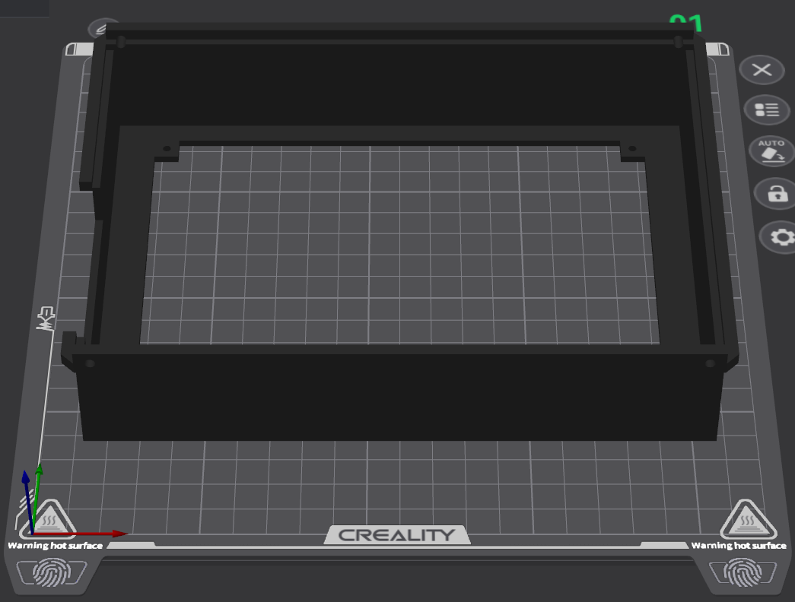
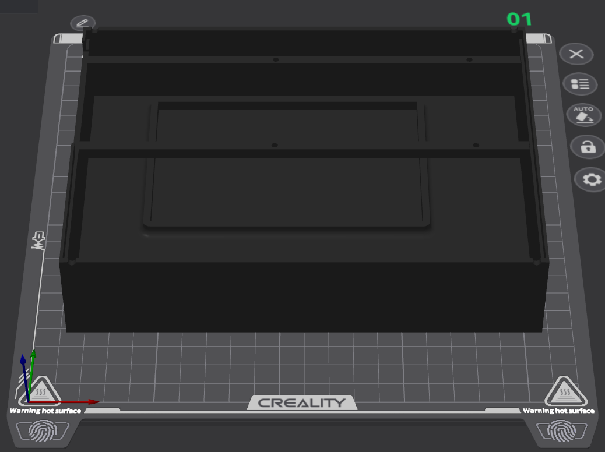

# Printer Settings

Hey there! This document is a place to store my print settings. Due to the open-source nature of Stardeck, you can already find those by looking in `assets/cad`, where you'll see the `.3mf` project files used to print the enclosure. This document is your reference point if a slicer import does not preserve every setting, so if you're here after that happened, you're welcome!

## Printer

**Printer model:** Creality Hi

**Nozzle diameter:** 0.4 mm

## Filament

**Material:** PLA

**Nozzle temperature:** 210 °C (default profile)

**Bed temperature:** 60 °C

**Cooling:** Default PLA profile

## Print

**Slicer:** Creality Print 7.x

**Layer height:** 0.2 mm

**Initial layer height:** 0.2 mm

**Wall loops:** 2

**Top shell layers:** 4

**Bottom shell layers:** 4

**Infill density:** 15%

**Sparse infill pattern:** Rectilinear

**Internal solid infill pattern:** Monotonic

**Outer wall speed:** 200 mm/s

**Inner wall speed:** 300 mm/s

**Sparse infill speed:** 270 mm/s

**Internal solid infill speed:** 250 mm/s

**Top surface speed:** 200 mm/s

**Travel speed:** 300 mm/s

**Initial layer speed:** 50 mm/s

**Seam position:** Aligned

**Supports:** Enabled

**Support style (Tree):** Default

**Build plate:** Smooth PEI (High Temperature Plate)

**Build plate adhesion (Brim, etc.):** None

## Helpful Tips

When printing each shell, orient your print so that the biggest face is touching the printbed. (Print orientation photos demonstrate this below.) For the bottom shell, keep the bottom-side face down, and for the top shell, keep the screen-side face down.

- Approximate Print Time (Top Shell): 4 Hours, 48 Minutes
- Filament Usage (Top Shell): ~102.74 g

- Approximate Print Time (Bottom Shell): 4 Hours, 36 Minutes
- Filament Usage (Bottom Shell): ~144.18 g

After setting up these orientations, it's recommended to add automatic tree supports to support the floating cantilever (from the mounting rails) in the bottom shell and the overhanging alignment lips in the top shell.

If you're using the included `.3mf` project files, no need to worry - these orientations and supports should already be preserved.

## Note

The accompanying `.3mf` project files preserve the print orientation, support placement, and slicer settings used to produce the printable models in this repository, including the first physical enclosure documented in `JOURNAL.md`.